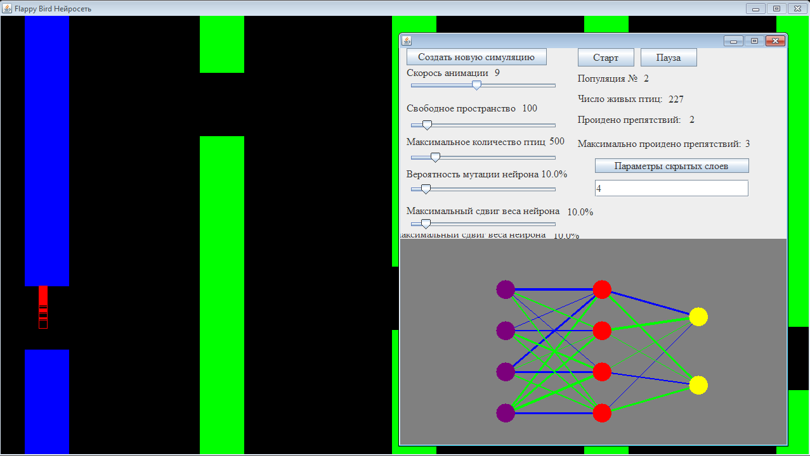
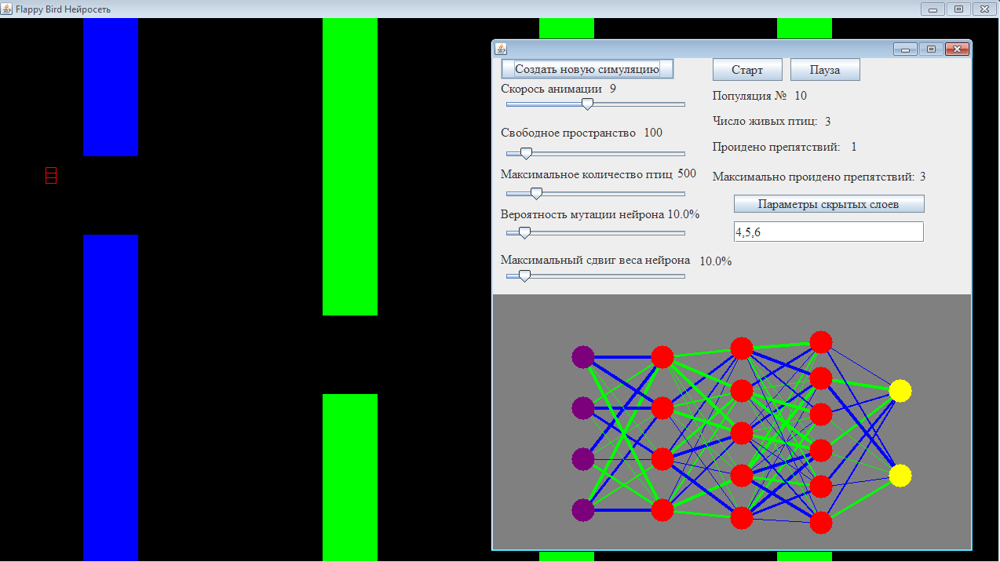

# FlappyBirdAI

FlappyBirdAI is Java project that is based on Flappy Bird game. This project uses a fully connected neural network and demonstates the evolution of AI in all stages.
# Features
Control of:
  - Animation speed 
  - Gap between pipes 
  - Maximum population of birds 
  - Chance to mutate NN
  - Change the hidden layers properties
  
Information about:
  - Population count
  - Number of birds on screen
  - Number of obstacles passed
  - Maximum number of obstacles passed within generation
  - Visualization the weights and connection between nodes
# Examples
***Example 1***

***Example 2***

